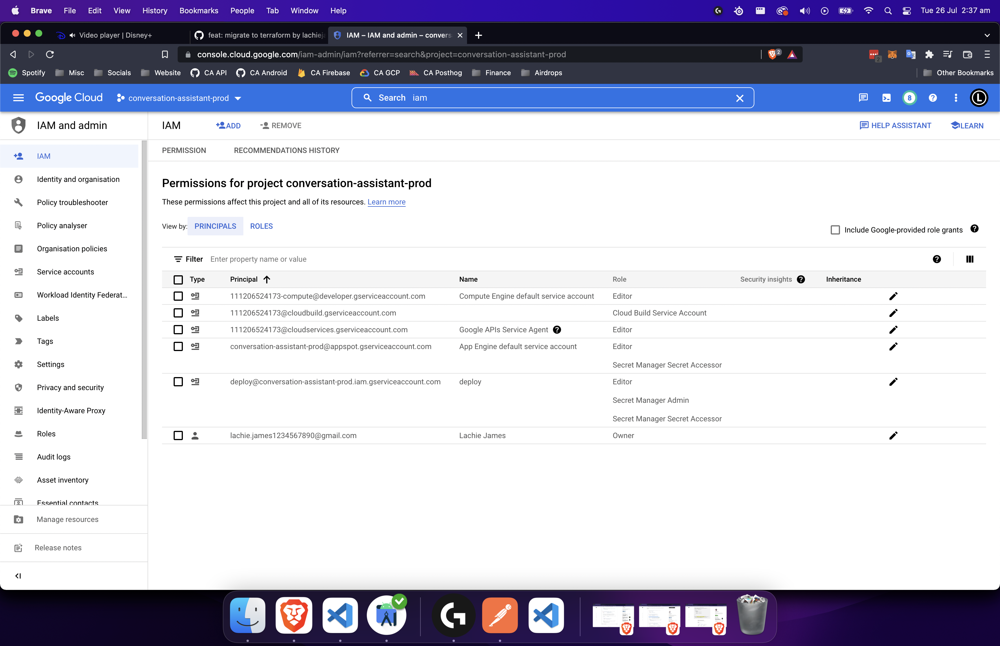

# infra

Before this can be deployed, you must do the following:

1. Create a GCP project

2. Create a Service Account and download the credentials as per [these steps](https://learn.hashicorp.com/tutorials/terraform/google-cloud-platform-build?in=terraform/gcp-get-started)

3. Enable the following APIs

   - Secret Manager API
   - Cloud Build API
   - Compute Engine API
   - Cloud Translation API
   - Cloud Functions API

4. Add permissions to your Service accounts until it looks like this:

5. Add the following secrets to Secret Manager

   - OPENAI_API_KEY
